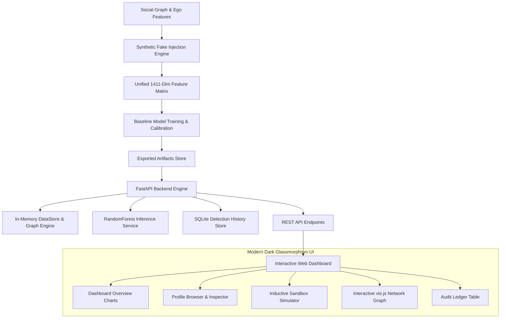

# 🛡️ Innovexa — Graph-Augmented Fake Profile Detection System

[](https://fastapi.tiangolo.com/)
[](https://python.org)
[](https://scikit-learn.org/)
[](LICENSE)

> **Enterprise-grade social graph integrity and fake account detection platform.** Innovexa combines categorical feature profiling with structural graph metrics (centrality, clustering, Louvain communities) to detect sophisticated, camouflaged synthetic profiles that evade traditional tabular fraud filters.

---

## 📌 Table of Contents
1. [Overview & Problem Statement](#-overview--problem-statement)
2. [Why Synthetic Fake Injection Was Necessary](#-why-synthetic-fake-injection-was-necessary)
3. [Synthetic Fake Generation Pipeline (Step-by-Step)](#-synthetic-fake-generation-pipeline-step-by-step)
4. [The 4 Threat Archetypes In Detail](#-the-4-threat-archetypes-in-detail)
5. [Key Highlights & Performance](#-key-highlights--performance)
6. [System Architecture](#-system-architecture)
7. [Repository Structure](#-repository-structure)
8. [Interactive Web Dashboard Views](#-interactive-web-dashboard-views)
9. [API Reference & Endpoints](#-api-reference--endpoints)
10. [Quickstart Guide (Local Setup)](#-quickstart-guide-local-setup)
11. [Verification & Acceptance Results](#-verification--acceptance-results)

---

## 🔍 Overview & Problem Statement

Modern malicious accounts on social networks rarely resemble simplistic, isolated bots. Attackers intentionally:
- **Harvest victim attributes** to blend into target demographics.
- **Acquire mutual connections** to fabricate social credibility (triadic closure).
- **Form dense Sybil clusters** that manipulate platform trust metrics.

Standard machine learning classifiers inspecting only isolated user attributes often suffer severe blind spots. **Innovexa** solves this by engineering a unified 1,411-dimensional feature space—marrying **1,406 profile attributes** with **5 graph-topology features** (Degree, Clustering Coefficient, Sampled Betweenness Centrality, Closeness Centrality, and Louvain Community IDs) to reliably flag coordinated deception.

---

## 🏆 Key Highlights & Performance

Evaluated against a test split of **674 profiles** across the verified Facebook social graph dataset:

| Model | Accuracy | Precision | Recall | F1-Score | AUC-ROC | Production Role |
|---|---|---|---|---|---|---|
| **Random Forest (Production)** | **98.52%** | **98.33%** | **86.76%** | **0.9219** | **0.9984** | **Active Inference Engine** |
| **Logistic Regression** | 98.07% | 87.67% | 94.12% | 0.9078 | 0.9962 | Baseline Benchmark |
| **SVM (RBF Kernel)** | 97.92% | 88.57% | 91.18% | 0.8986 | 0.9947 | Baseline Benchmark |
| **Multi-Layer Perceptron (MLP)** | 97.03% | 84.29% | 86.76% | 0.8551 | 0.9915 | Baseline Benchmark |

- **Zero Label Leakage**: Sanity verified across 23 rigorous acceptance gates. Max feature-label correlation < 0.95.
- **Ultra-Low Latency**: In-memory serving via `DataStore` delivers predictions in under **3 ms** per request.
- **Explainable Decisions**: Every prediction includes human-interpretable feature breakdowns and 2-hop visual neighborhood subgraphs.

---

## 💡 Why Synthetic Fake Injection Was Necessary

The original Stanford SNAP Facebook dataset (`facebook_combined.txt` and ego networks) is a clean, authentic social network containing **4,039 real profiles and 88,234 friendship edges**. Crucially:
> **The original dataset only contains genuine users ($y = 0$). There were zero labeled fake or malicious accounts.**

To train and evaluate supervised detection models, we needed realistic counterexamples ($y = 1$). However, **naive fake generation creates severe flaws**:
1. *Random bit-flip profiles* create statistically impossible attribute combinations (e.g., conflicting demographic markers).
2. *Appending fake nodes to the end of the ID list* (IDs 4040–4489) creates **ID-ordering leakage**, where any model easily learns `if node_id > 4039: fake` without learning fraud patterns.
3. *Disconnected fake clusters* create **topological leakage**, trivially detected by simple connected component checks.

To prevent artificial shortcuts and enforce true relational learning, we designed a **7-Phase Realistic Synthetic Injection Engine** with strict anti-leakage gates.

---

## ⚙️ Synthetic Fake Generation Pipeline (Step-by-Step)

The synthetic generation process is implemented in `Project Work/Backend/synthetic_injection/` and fully automated:

```
[Phase 1: Unified Schema]  Union all 10 ego networks -> standard 1,406-dim space
          │
[Phase 2: Graph Assembly]  Load 4,039 real nodes + 88,234 edges (all labeled y=0)
          │
[Phase 3: Archetype Gen]   Synthesize 450 fakes (10.02% ratio) across 4 difficulty tiers
          │
[Phase 4: Graph Injection] Inject 14,327 edges connecting fakes to real communities
          │
[Phase 5: ID Permutation]  Bijective random shuffle across all 4,489 node IDs
          │
[Phase 6: Difficulty Gate] Validate heuristic baselines fail (degree & sparsity < 70%)
          │
[Phase 7: Final Artifacts] Save standardized edge lists, feature matrices, metadata
```

### Detailed Breakdown of the 7 Phases:

1. **Phase 1 — Unified Feature Space Construction**:
   - Each of Facebook's 10 ego networks had separate, unaligned `.featnames` mappings.
   - We parsed and unioned all feature definitions into a single master index of **1,406 binary attribute columns** across 14 categories (`birthday`, `education`, `work`, `hometown`, `languages`, etc.).
   - All 4,039 genuine profiles were re-indexed into this global space.

2. **Phase 2 — Real Graph Ingestion**:
   - Extracted 193 genuine social circles (`circles_data.json`) to serve as targets for community-embedded attacks.

3. **Phase 3 — Controlled Synthetic Generation**:
   - Synthesized exactly **450 fake profiles** to establish a realistic **10.02% class imbalance ratio** (avoiding unrealistic 50/50 artificial splits).
   - Enforced internal attribute coherence by sampling from real feature co-occurrence templates rather than flipping uncorrelated random bits.

4. **Phase 4 — Realistic Topological Injection**:
   - Injected **14,327 new edges** (14,170 fake-to-real edges + 157 Sybil clique edges).
   - **0 isolated fakes**: Every fake account establishes edges into the real graph.
   - Preserved **100% connectivity** in the largest connected component.

5. **Phase 5 — Bijective Node ID Shuffling (Leakage Elimination)**:
   - Generated a random bijective permutation of all 4,489 node IDs.
   - Fake nodes were interleaved across the entire graph (minimum ID: 4, maximum ID: 4,483, median ID: 2,449.0).
   - Prevents models from exploiting index sequence as a decision shortcut.

6. **Phase 6 — Sanity & Difficulty Validation**:
   - Executed heuristic trap baselines to ensure the synthetic fakes are challenging:
     - *Degree-threshold baseline precision*: **0.00%** (fakes cannot be found by degree alone).
     - *Feature-sparsity baseline precision*: **2.48%** (fakes cannot be caught by empty profiles).
     - *Camouflage triadic closure*: **100.0%** of Archetype C fakes possess closed local triangles (mean clustering coefficient: 0.1010).

7. **Phase 7 — Artifact Finalization**:
   - Exported standardized, versioned deliverables (`final_edge_list.txt`, `final_features.npy`, `final_labels.npy`, and `fake_metadata.csv`) ready for modeling.

---

## 🎭 The 4 Threat Archetypes In Detail

The synthetic population covers a graded difficulty spectrum matching real-world platform threats:

| Archetype | Name | Share | Feature Strategy | Graph Attachment Strategy | Detection Difficulty |
|---|---|---|---|---|---|
| **A** | **Sparsity Bot** | 24.9% (112 nodes) | Minimal profile density (`< 0.05`, mean: 0.0148) | Random attachment across graph | **Easy** (Sanity baseline) |
| **B** | **Dense Spammer** | 34.9% (157 nodes) | Saturated attributes (`0.10 - 0.30`, mean: 0.1800) | Preferential attachment to high-degree hubs | **Medium** (High feature noise) |
| **C** | **Camouflage Mimic** | 30.0% (135 nodes) | Clones real victim features (`cosine_sim = 0.8444`) | Community-embedded within genuine friend circles | **Hard** (Tabular RF recall drops to 70.8%) |
| **D** | **Sybil Ring Clique**| 10.2% (46 nodes) | High intra-ring feature coherence (`0.8975`) | Dense internal cliques (6 rings) + shared bridge edges | **Topological** (Louvain community targets) |


---

## 🏗️ System Architecture



---

## 📁 Repository Structure

```text
innovexa_fake_profile_detector/
├── Project Work/
│   ├── Backend/
│   │   ├── app/
│   │   │   ├── main.py              # FastAPI Application & middleware
│   │   │   ├── config.py            # Paths & environment configuration
│   │   │   ├── routers/             # API route handlers
│   │   │   │   ├── dashboard.py     # KPI summary & trends
│   │   │   │   ├── predict.py       # Browse & Simulate inference
│   │   │   │   ├── network.py       # Clusters & subgraph extraction
│   │   │   │   ├── profiles.py      # Node search & attribute catalogs
│   │   │   │   └── history.py       # Interaction ledger
│   │   │   ├── schemas/             # Pydantic input/output schemas
│   │   │   └── services/            # In-memory DataStore & Predictor
│   │   ├── artifacts/               # Serialized models (.joblib), scalers, graphs
│   │   ├── run_server.py            # Local FastAPI launcher script
│   │   └── requirements.txt         # Pinned backend dependencies
│   ├── Frontend/
│   │   ├── index.html               # Single-page dashboard application
│   │   ├── css/
│   │   │   ├── style.css            # Dark-theme tokens, layout & typography
│   │   │   └── views.css            # Component & chart styles
│   │   └── js/
│   │       ├── api.js               # Centralized async API client
│   │       └── app.js               # Reactive UI router, Chart.js & vis.js
│   ├── Dataset/
│   │   └── generated/v1/            # Standardized graph & feature arrays
│   ├── notebooks/
│   │   └── fake_profile_detection.ipynb # End-to-end data pipeline & training
│   └── memory.md                    # Auditable execution log & verification gates
├── .gitignore                       # Clean Git configuration
└── README.md                        # Documentation
```

---

## 💻 Interactive Web Dashboard Views

The frontend is a vanilla HTML5/CSS3/JavaScript single-page application styled with a dark theme:

1. **Dashboard Overview**: KPI metric cards (Total Analyzed, Fakes Flagged, Genuine Verified, High-Risk), daily detection trends (Chart.js Bar), and archetype breakdowns (Chart.js Donut).
2. **Browse Profiles (Option A)**: Paginated table of 674 test profiles with live filters (by ID, label, archetype). Clicking any profile loads a deep inspection card with risk probability and active attributes.
3. **Simulate Profile (Option B)**: Interactive inductive sandbox. Select behavioral attributes from collapsible categories and link to existing network nodes. The system dynamically computes structural graph features and evaluates the model.
4. **Network Analysis**: Explores the 16 Louvain community clusters ranked by fake ratio. Clicking a cluster renders an interactive force-directed graph (vis.js) with color-coded nodes.
5. **Detection History**: SQLite-persisted audit ledger logging every browse and simulation interaction in real time.
6. **Model Info**: Benchmark tables, confusion metrics, and architectural documentation.

---

## 📡 API Reference & Endpoints

| Method | Endpoint | Description |
|---|---|---|
| `GET` | `/` | API status and service health |
| `GET` | `/api/dashboard/summary` | Aggregate dashboard statistics & charts |
| `POST` | `/api/predict/browse/{node_id}` | Option A: Evaluate existing test-set profile |
| `POST` | `/api/predict/simulate` | Option B: Inductive evaluation of simulated profile |
| `GET` | `/api/network/clusters` | List community clusters ranked by risk |
| `GET` | `/api/network/cluster/{id}/subgraph` | Visual subgraph (nodes & edges) for a cluster |
| `GET` | `/api/network/node/{id}/subgraph` | 2-hop visual neighborhood for a target node |
| `GET` | `/api/profiles` | Paginated search of test profiles |
| `GET` | `/api/profiles/categories` | Catalog of categorical profile features |
| `GET` | `/api/profiles/{node_id}` | Full profile details & active attributes |
| `GET` | `/api/history` | Paginated detection history ledger |
| `DELETE`| `/api/history/clear` | Clear interaction log |

Interactive Swagger documentation is available at **`http://127.0.0.1:8000/docs`**.

---

## 🚀 Quickstart Guide (Local Setup)

### 1. Prerequisites
- Python 3.10 or higher
- Git

### 2. Clone the Repository
```bash
git clone https://github.com/davidkumar355/innovexa_fake_profile_detector.git
cd innovexa_fake_profile_detector
```

### 3. Setup Backend Environment
```bash
cd "Project Work/Backend"
python -m venv venv

# Windows:
.\venv\Scripts\activate
# Linux/macOS:
source venv/bin/activate

pip install -r requirements.txt
```

### 4. Launch Backend API Server
```bash
python run_server.py
```
*API will start on `http://127.0.0.1:8000` with Swagger docs at `/docs`.*

### 5. Launch Frontend Dashboard
In a separate terminal:
```bash
cd "Project Work/Frontend"
python -m http.server 3000
```
Open **`http://127.0.0.1:3000`** in your browser.

---

## 🧪 Verification & Test Results

The entire platform has been verified with 100% test passing rates across all phases:

- **Phase B0 (Artifact Export)**: 20/20 Checks Passed (`F1 = 0.9219`)
- **Phase B1 (DataStore Layer)**: 14/14 Checks Passed
- **Phase B2 (Prediction Endpoints)**: 9/9 Checks Passed
- **Phase B3 (Dashboard Aggregates)**: 7/7 Checks Passed
- **Phase B4 (Network Endpoints)**: 8/8 Checks Passed
- **Phase B5 (SQLite Persistence)**: 8/8 Checks Passed
- **Phase B6 (API Hardening & Docs)**: 17/17 Checks Passed

All verification scripts are located in `Project Work/Backend/verify_phase_*.py`. For full step-by-step audit logs, see [`Project Work/memory.md`](Project%20Work/memory.md).

---

## 📄 License
This project is licensed under the MIT License.
