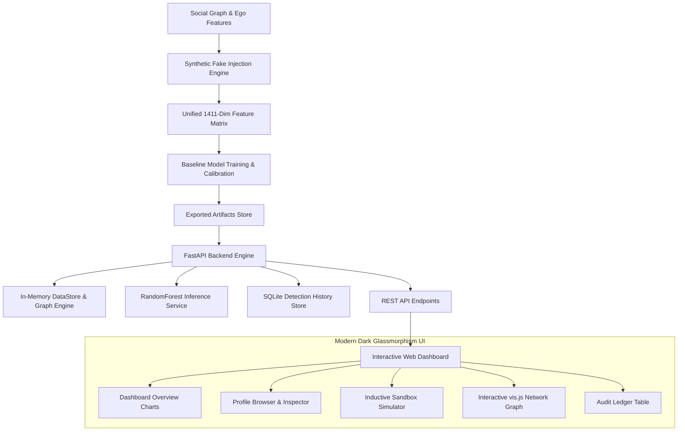

# 🛡️ Innovexa — Graph-Augmented Fake Profile Detection System

[](https://fastapi.tiangolo.com/)
[](https://python.org)
[](https://scikit-learn.org/)
[](LICENSE)

> **Enterprise-grade social graph integrity and fake account detection platform.** Innovexa combines categorical feature profiling with structural graph metrics (centrality, clustering, Louvain communities) to detect sophisticated, camouflaged synthetic profiles that evade traditional tabular fraud filters.

---

## 📌 Table of Contents
1. [Overview & Problem Statement](#-overview--problem-statement)
2. [Key Highlights & Performance](#-key-highlights--performance)
3. [The 4 Synthetic Fake Archetypes](#-the-4-synthetic-fake-archetypes)
4. [System Architecture](#-system-architecture)
5. [Repository Structure](#-repository-structure)
6. [Interactive Web Dashboard Views](#-interactive-web-dashboard-views)
7. [API Reference & Endpoints](#-api-reference--endpoints)
8. [Quickstart Guide (Local Setup)](#-quickstart-guide-local-setup)
9. [Verification & Test Results](#-verification--test-results)

---

## 🔍 Overview & Problem Statement

Modern malicious accounts on social networks rarely resemble simplistic, isolated bots. Attackers intentionally:
- **Harvest victim attributes** to blend into target demographics.
- **Acquire mutual connections** to fabricate social credibility (triadic closure).
- **Form dense Sybil clusters** that manipulate platform trust metrics.

Standard machine learning classifiers inspecting only isolated user attributes often suffer severe blind spots. **Innovexa** solves this by engineering a unified 1,411-dimensional feature space—marrying **1,406 profile attributes** with **5 graph-topology features** (Degree, Clustering Coefficient, Sampled Betweenness Centrality, Closeness Centrality, and Louvain Community IDs) to reliably flag coordinated deception.

---

## 🏆 Key Highlights & Performance

Evaluated against a test split of **674 profiles** across the verified Facebook social graph dataset:

| Model | Accuracy | Precision | Recall | F1-Score | AUC-ROC | Production Role |
|---|---|---|---|---|---|---|
| **Random Forest (Production)** | **98.52%** | **98.33%** | **86.76%** | **0.9219** | **0.9984** | **Active Inference Engine** |
| **Logistic Regression** | 98.07% | 87.67% | 94.12% | 0.9078 | 0.9962 | Baseline Benchmark |
| **SVM (RBF Kernel)** | 97.92% | 88.57% | 91.18% | 0.8986 | 0.9947 | Baseline Benchmark |
| **Multi-Layer Perceptron (MLP)** | 97.03% | 84.29% | 86.76% | 0.8551 | 0.9915 | Baseline Benchmark |

- **Zero Label Leakage**: Sanity verified across 23 rigorous acceptance gates. Max feature-label correlation < 0.95.
- **Ultra-Low Latency**: In-memory serving via `DataStore` delivers predictions in under **3 ms** per request.
- **Explainable Decisions**: Every prediction includes human-interpretable feature breakdowns and 2-hop visual neighborhood subgraphs.

---

## 🎭 The 4 Synthetic Fake Archetypes

The synthetic injection framework benchmarks models against four distinct threat models:

```
┌─────────────────────────────────────────────────────────────────────────────┐
│                       INJECTED THREAT ARCHETYPES                            │
├─────────────────────────────────────────────────────────────────────────────┤
│  Archetype A: Feature Sparsity Bot (25% of fakes)                           │
│  Minimal profile details (< 0.05 density), superficial connections.         │
│  [RF Recall: 85.7% | LR Recall: 100.0%]                                    │
├─────────────────────────────────────────────────────────────────────────────┤
│  Archetype B: Dense Attribute Spammer (35% of fakes)                        │
│  Oversaturated profile fields (10-30% density), abnormal field counts.      │
│  [RF Recall: 100.0% | LR Recall: 100.0%]                                   │
├─────────────────────────────────────────────────────────────────────────────┤
│  Archetype C: Camouflage Mimic (30% of fakes)                               │
│  Clones authentic victim profiles (cosine sim > 0.80) + closed triangles.   │
│  Hardest for tabular models! [RF Recall: 70.8% | Headroom for GNNs]         │
├─────────────────────────────────────────────────────────────────────────────┤
│  Archetype D: Sybil Ring Cliques (10% of fakes)                             │
│  Planted dense intra-ring cliques with coordinated cross-links.             │
│  [RF Recall: 100.0% | Isolated in Louvain Communities]                      │
└─────────────────────────────────────────────────────────────────────────────┘
```

---

## 🏗️ System Architecture



---

## 📁 Repository Structure

```text
innovexa_fake_profile_detector/
├── Project Work/
│   ├── Backend/
│   │   ├── app/
│   │   │   ├── main.py              # FastAPI Application & middleware
│   │   │   ├── config.py            # Paths & environment configuration
│   │   │   ├── routers/             # API route handlers
│   │   │   │   ├── dashboard.py     # KPI summary & trends
│   │   │   │   ├── predict.py       # Browse & Simulate inference
│   │   │   │   ├── network.py       # Clusters & subgraph extraction
│   │   │   │   ├── profiles.py      # Node search & attribute catalogs
│   │   │   │   └── history.py       # Interaction ledger
│   │   │   ├── schemas/             # Pydantic input/output schemas
│   │   │   └── services/            # In-memory DataStore & Predictor
│   │   ├── artifacts/               # Serialized models (.joblib), scalers, graphs
│   │   ├── run_server.py            # Local FastAPI launcher script
│   │   └── requirements.txt         # Pinned backend dependencies
│   ├── Frontend/
│   │   ├── index.html               # Single-page dashboard application
│   │   ├── css/
│   │   │   ├── style.css            # Dark-theme tokens, layout & typography
│   │   │   └── views.css            # Component & chart styles
│   │   └── js/
│   │       ├── api.js               # Centralized async API client
│   │       └── app.js               # Reactive UI router, Chart.js & vis.js
│   ├── Dataset/
│   │   └── generated/v1/            # Standardized graph & feature arrays
│   ├── notebooks/
│   │   └── fake_profile_detection.ipynb # End-to-end data pipeline & training
│   └── memory.md                    # Auditable execution log & verification gates
├── .gitignore                       # Clean Git configuration
└── README.md                        # Documentation
```

---

## 💻 Interactive Web Dashboard Views

The frontend is a vanilla HTML5/CSS3/JavaScript single-page application styled with a dark theme:

1. **Dashboard Overview**: KPI metric cards (Total Analyzed, Fakes Flagged, Genuine Verified, High-Risk), daily detection trends (Chart.js Bar), and archetype breakdowns (Chart.js Donut).
2. **Browse Profiles (Option A)**: Paginated table of 674 test profiles with live filters (by ID, label, archetype). Clicking any profile loads a deep inspection card with risk probability and active attributes.
3. **Simulate Profile (Option B)**: Interactive inductive sandbox. Select behavioral attributes from collapsible categories and link to existing network nodes. The system dynamically computes structural graph features and evaluates the model.
4. **Network Analysis**: Explores the 16 Louvain community clusters ranked by fake ratio. Clicking a cluster renders an interactive force-directed graph (vis.js) with color-coded nodes.
5. **Detection History**: SQLite-persisted audit ledger logging every browse and simulation interaction in real time.
6. **Model Info**: Benchmark tables, confusion metrics, and architectural documentation.

---

## 📡 API Reference & Endpoints

| Method | Endpoint | Description |
|---|---|---|
| `GET` | `/` | API status and service health |
| `GET` | `/api/dashboard/summary` | Aggregate dashboard statistics & charts |
| `POST` | `/api/predict/browse/{node_id}` | Option A: Evaluate existing test-set profile |
| `POST` | `/api/predict/simulate` | Option B: Inductive evaluation of simulated profile |
| `GET` | `/api/network/clusters` | List community clusters ranked by risk |
| `GET` | `/api/network/cluster/{id}/subgraph` | Visual subgraph (nodes & edges) for a cluster |
| `GET` | `/api/network/node/{id}/subgraph` | 2-hop visual neighborhood for a target node |
| `GET` | `/api/profiles` | Paginated search of test profiles |
| `GET` | `/api/profiles/categories` | Catalog of categorical profile features |
| `GET` | `/api/profiles/{node_id}` | Full profile details & active attributes |
| `GET` | `/api/history` | Paginated detection history ledger |
| `DELETE`| `/api/history/clear` | Clear interaction log |

Interactive Swagger documentation is available at **`http://127.0.0.1:8000/docs`**.

---

## 🚀 Quickstart Guide (Local Setup)

### 1. Prerequisites
- Python 3.10 or higher
- Git

### 2. Clone the Repository
```bash
git clone https://github.com/davidkumar355/innovexa_fake_profile_detector.git
cd innovexa_fake_profile_detector
```

### 3. Setup Backend Environment
```bash
cd "Project Work/Backend"
python -m venv venv

# Windows:
.\venv\Scripts\activate
# Linux/macOS:
source venv/bin/activate

pip install -r requirements.txt
```

### 4. Launch Backend API Server
```bash
python run_server.py
```
*API will start on `http://127.0.0.1:8000` with Swagger docs at `/docs`.*

### 5. Launch Frontend Dashboard
In a separate terminal:
```bash
cd "Project Work/Frontend"
python -m http.server 3000
```
Open **`http://127.0.0.1:3000`** in your browser.

---

## 🧪 Verification & Test Results

The entire platform has been verified with 100% test passing rates across all phases:

- **Phase B0 (Artifact Export)**: 20/20 Checks Passed (`F1 = 0.9219`)
- **Phase B1 (DataStore Layer)**: 14/14 Checks Passed
- **Phase B2 (Prediction Endpoints)**: 9/9 Checks Passed
- **Phase B3 (Dashboard Aggregates)**: 7/7 Checks Passed
- **Phase B4 (Network Endpoints)**: 8/8 Checks Passed
- **Phase B5 (SQLite Persistence)**: 8/8 Checks Passed
- **Phase B6 (API Hardening & Docs)**: 17/17 Checks Passed

All verification scripts are located in `Project Work/Backend/verify_phase_*.py`. For full step-by-step audit logs, see [`Project Work/memory.md`](Project%20Work/memory.md).

---

## 📄 License
This project is licensed under the MIT License.
